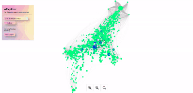

<h1 align="center">
  wExplore
</h1>
<h2 align="center">
  A research tool to create a visually explorable linked knowledge network about Wikipedia topics.

## 🚀 Demo




## 💥 Usage

View:

- Navigate in your browser (desktop only!)
- Click "View Graphs" to see what others have researched.

Create:

- Submit your own by searching/submitting. It must be an exact case-sensitive wikipedia page!

Access:

- Access the API with a few endpoints
  `./api/find/uuid`
  `./api/find/title`
  `./api/find/all-titles`

## 🧐 Features

- Performant Visualization
  - Can scale to 10k+ nodes and 100k+ edges
- Hands-free Wikipedia scraping
- Easy API

## 🛠️ Local Installation Steps

1. Clone the repository

```bash
git clone https://github.com/james-salafatinos/wExplore.git
```

2. Change the working directory

```bash
cd wExplore
```

3. Install dependencies

```bash
npm install
pip install pandas numpy fa2 networkx requests Cython matplotlib
```

**NOTE you must have Microsoft Visual Studio Build Tools installed for `fa2`**
https://visualstudio.microsoft.com/downloads/#build-tools-for-visual-studio-2019

4. Run the app

```bash
npm start
```

5. Visit

```bash
 http://localhost:8080/
```

🌟 You are all set!

## 🛠️ Cloud Deployment (GCP)

1. Clone the repository via the Cloud Shell

```bash
git clone https://github.com/james-salafatinos/wExplore.git
cd wExplore
```

2. Create a `.env` file

- Give `DB_URI` and `ENVIRONMENT` variables

3. Deploy

```
gcloud app deploy
```

Google App Engine will first look at the `app.yaml` file and see that this is a custom runtime. It will then use the `Dockerfile` to create a container to deploy to a Google managed VM.
The Docker file specifies the environment for this application to run (python [including C++ build tools] and node.js.

## 💻 Built with

- [OII Network Visualization](https://github.com/oxfordinternetinstitute/InteractiveVis/)
- [Sigma.js]
- [MongoDB]
- [Node.js]
- [Express.js]
- [GCP]

## 🙇 Special Thanks

## Todo

- [x] Implement loading screen / loading wheel after new graph submit
- [x] Implement initial "library" of submitted nodes for the user to browse (i.e., a list of network titles (John Church) a user can initially click into and browse instantly)
- [x] Fix ability to refresh after a new graph submittal without worrying about re-submitting
- [x] Handle the timeout error that may happen when way too many Wikipedia API requests are called
- [x] Implement error handling / messaging to user (i.e., That was too large of a graph, sorry.)
- [x] Implement ability to click on node and it opens a tab / a button that appears to go to wikipedia
- [ ] Implement doc linking to mitigate MongoDB 16mb limit
- [ ] Implement option to have user control some visual parameters

## Issues

- [ ] MongoDB Doc size limit
- [ ] Mobile access and usability

## Thoughts

- [ ] Can reduce file storage size by offloading the data.json construction (color_map, size_map, data.json) to the client. Then can store flat files of |source|target|force atlas embedding|.
